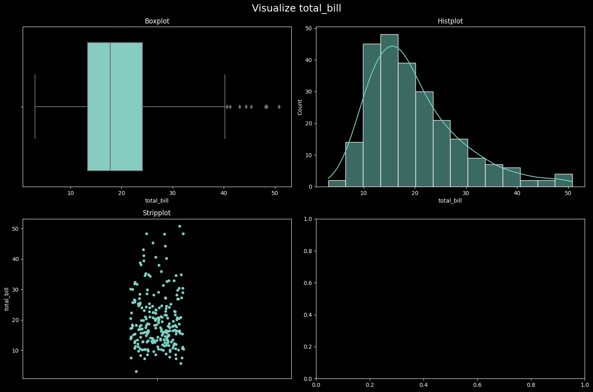

# Easy Analysis

Use this package to perform **Data Analysis** easily.

### Installation

```sh
pip install arv-easy-analysis
```

### Examples

For examples, we are working on **tips** dataset from `seaborn` library.

```python
import seaborn as sns
tips = sns.load_dataset("tips")
```

1. `data.summary` module.

Get the custom and more insightful summary of your data.

```python
from easy_analysis.data import summary

summary.custom_describe(tips[["total_bill", "tip", "size"]])
```

**Output:**

|          | total_bill |   tip |  size |
| :------- | ---------: | ----: | ----: |
| count    |        244 |   244 |   244 |
| mean     |     19.786 | 2.998 |  2.57 |
| std      |      8.902 | 1.384 | 0.951 |
| min      |       3.07 |     1 |     1 |
| 1%       |       7.25 |     1 |     1 |
| 5%       |      9.558 |  1.44 |     2 |
| 25%      |     13.348 |     2 |     2 |
| 50%      |     17.795 |   2.9 |     2 |
| 75%      |     24.127 | 3.562 |     3 |
| 95%      |     38.061 | 5.196 |     4 |
| 99%      |     48.227 | 7.214 |     6 |
| max      |      50.81 |    10 |     6 |
| skew     |      1.133 | 1.465 | 1.448 |
| kurtosis |      1.218 | 3.648 | 1.732 |
| notnull  |        244 |   244 |   244 |
| isnull   |          0 |     0 |     0 |

2. `data.outliers` module

This function extract the outliers from the given dataset using **IQR** method and returns the dataframe.

```python
from easy_analysis.data import outliers
outliers.extract_outliers(tips[["total_bill", "tip", "size"]], "total_bill")
```

**Output:**

| total_bill |  tip | size |
| ---------: | ---: | ---: |
|      50.81 |   10 |    3 |
|      48.33 |    9 |    4 |
|      48.27 | 6.73 |    4 |
|      48.17 |    5 |    6 |
|      45.35 |  3.5 |    3 |
|       44.3 |  2.5 |    3 |
|      43.11 |    5 |    4 |
|      41.19 |    5 |    5 |
|      40.55 |    3 |    2 |

3. `plots.univariate` module

Use it for comprehensive univariate plots.

```python
from easy_analysis.plots import univariate
univariate.visualize_feature(tips["total_bill"])
```



4. `plots.insights`

Use `insights.null_plot` function to get overview of null values in a graph.

```python
from easy_analysis.plots import insights
insights.null_plot(tips)  # Output: A graph which gives a overview of null values.
```

### Issues

If you have any issue or query related to this project you can raise [here](https://github.com/arv-anshul/easy-analysis/issues).

### Authors

- [@arv-anshul](https://github.com/arv-anshul)
